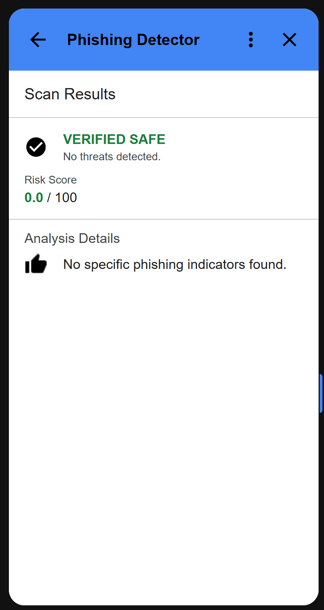
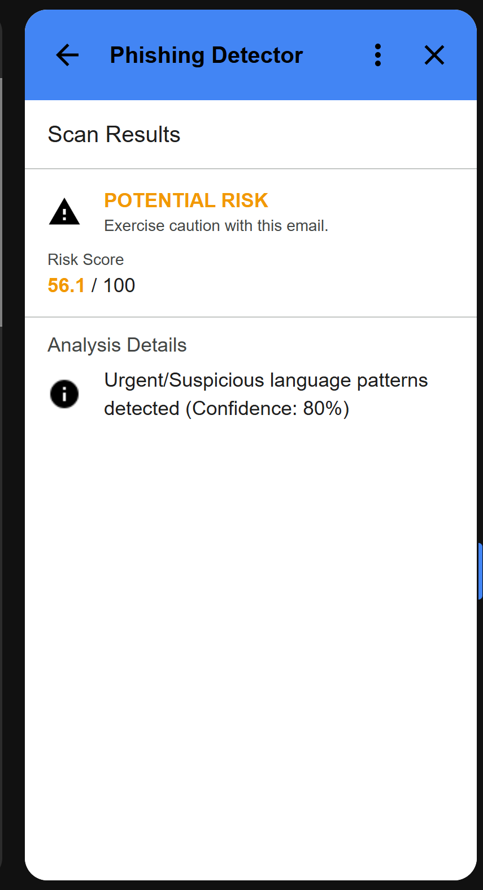

#  Phishing Detection Gmail Addon


A professional-grade Gmail add-on that scans incoming emails for phishing attempts. It combines high-speed **Word-Based AI** with advanced rule-based heuristics to identify threats that standard spam filters miss.

## What It Checks

- **Word-Based AI Analysis**: Uses a Naive Bayes classifier to detect **urgent**, threatening, or suspicious language patterns with extreme precision (**0.90+ confidence**).
- **Brand Protection**: Flags emails claiming to be from trusted entities (Microsoft, PayPal, etc.) but sent from unrelated domains.
- **Malicious Links**: Detects link masking, URL shorteners, raw IPs, and high-risk Top-Level Domains (TLDs).
- **Harmful Attachments**: Identifies dangerous extensions (`.exe`, `.scr`, `.bat`), double-extension tricks (`invoice.pdf.exe`), and MIME type mismatches.
- **Email Authentication**: Verifies SPF, DKIM, and DMARC headers to ensure the sender is who they claim to be.

## Screenshots

| Safe Email | Suspicious Email | Dangerous Email |
| :---: | :---: | :---: |
|  |  |  |

## Detection Logic & Scoring

The system uses an **Aggregative Scoring Model**. Each detector (AI or Heuristic) contributes a "Suspicion Score". If the total score exceeds certain thresholds, the risk level is escalated.

### Detector Scoring Matrix

| Category | Detector | Risk Impact | Rationale |
|----------|----------|-------------|-----------|
| **Critical** | **Hidden Executable** | 100 | File claims to be `.pdf` but is actually binary code. |
| **Critical** | **Dangerous Extension** | 100 | Direct delivery of malware (`.exe`, `.scr`, etc.). |
| **High** | **Brand Impersonation** | 75 | Uses brand names in display while coming from rogue domains. |
| **High** | **MIME Mismatch** | 75 | Internal file structure contradicts its extension. |
| **High** | **Urgent & Suspicious Language** | 60 - 95 | Naive Bayes detects high-frequency phishing keywords (0.90 - 1.0 confidence). |
| **Medium** | **Domain Typosquatting** | 60 | Visual tricks like `micr0soft.com` or `paypa1.com`. |
| **Medium** | **Link Masking** | 50 | Text shows `google.com`, but the link redirects to `evil.com`. |
| **Low** | **Auth Failure** | 40 | SPF/DKIM/DMARC failed (common in low-tier marketing spam). |
| **Low** | **Suspicious TLD** | 20 | Use of `.xyz`, `.top`, `.buzz` or other high-spam TLDs. |

### Classic ML Model (Word-Based)

- **Algorithm**: Multinomial Naive Bayes (MNB).
- **Features**: TF-IDF Vectorization (Word & Bigram patterns, max 5,000 features).
- **Dataset**: [Phishing Email Dataset (Kaggle)](https://www.kaggle.com/datasets/naserabdullahalam/phishing-email-dataset) using the CEAS 2008 corpus.
- **Speed**: Ultra-fast inference (< 10ms per email).
- **Tuning**: High confidence threshold (**0.95**) to focus on clear "Smoking Gun" keywords.

## Architecture

```
┌─────────────────────────────────────────────────────────────────┐
│                         Gmail Inbox                             │
└─────────────────────────────────────────────────────────────────┘
                               │
                               ▼
┌─────────────────────────────────────────────────────────────────┐
│                    Google Apps Script                           │
│              (Gmail Add-on / Sidebar UI)                        │
└─────────────────────────────────────────────────────────────────┘
                               │
                               ▼ HTTP POST (MIME Content)
┌─────────────────────────────────────────────────────────────────┐
│                     FastAPI Backend                             │
│  ┌───────────────┐  ┌────────────────┐  ┌──────────────────┐   │
│  │  Email Parser │──│  Word-Based AI │──│ Heuristic        │   │
│  │  (MIME→JSON)  │  │ (Naive Bayes)  │  │ Detectors        │   │
│  └───────────────┘  └────────────────┘  └──────────────────┘   │
│                              │                                  │
│                              ▼                                  │
│                    ┌─────────────────┐                         │
│                    │ Scoring Service │                         │
│                    │ (Risk Analysis) │                         │
│                    └─────────────────┘                         │
└─────────────────────────────────────────────────────────────────┘
                               │
                               ▼ JSON Response
┌─────────────────────────────────────────────────────────────────┐
│              Risk Assessment (Safe / Suspicious / Dangerous)    │
└─────────────────────────────────────────────────────────────────┘
```

## Quick Start

### Docker (Recommended)
This is the fastest way to run the backend as it handles all ML dependencies automatically.

```bash
# Clone the repository
git clone https://github.com/yourusername/phishing-detection-gmail-addon.git
cd phishing-detection-gmail-addon

# Build and run
docker-compose up --build
```

### Local Development

1. **Setup Environment**:
   ```bash
   cd backend
   python -m venv venv
   source venv/bin/activate  # Windows: venv\Scripts\activate
   pip install -r requirements.txt
   ```

2. **Train the Model** (Optional):
   The backend includes a pre-trained head, but you can retrain it with:
   ```bash
   python ml/train_model.py
   ```

3. **Run Server**:
   ```bash
   uvicorn app.main:app --reload
   ```

## Gmail Add-on Setup

1. **Apps Script**: Open [script.google.com](https://script.google.com), create a new project.
2. **Copy Files**: Paste contents of `gmail-addon/*.gs` into the editor.
3. **Manifest**: Enable viewing `appsscript.json` in settings and replace with `gmail-addon/appsscripts.json`.
4. **URL**: Set your API URL in Script Properties or via the `setApiUrl` helper.
5. **Icon**: The add-on uses high-visibility Material Design security icons for clear status indication in both light and dark modes.

## API Specification

**`POST /api/scan`**
- **Payload**: `{ "mime": "..." }`
- **Returns**: A `RiskAssessment` object containing:
  - `status`: Safe, Suspicious, or Dangerous.
  - `score`: 0-100 normalization.
  - `reasons`: Human-readable explanations of why it was flagged.
  - `details`: Technical breakdown of individual detector hits.

## Project Structure

```
backend/
├── app/
│   ├── api/             # FastAPI Endpoints
│   ├── detectors/       # Logic Modules
│   │   ├── core/        # Base classes & Registry
│   │   ├── link_detector.py
│   │   ├── ...          # Specific detectors
│   ├── services/        # Scoring & ML Logic
├── ml/                  # Training scripts & Datasets
├── tests/               # Pytest Suite
Dockerfile
requirements.txt
```

---
